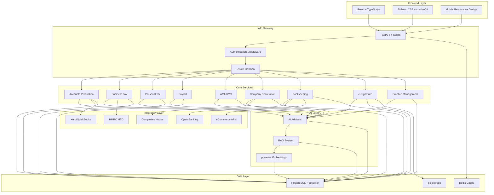

# Brisk Practice Suite - Architecture Documentation

## Overview

Brisk Practice Suite is a comprehensive, cloud-native accounting software platform designed for UK accounting firms and businesses. It features a multi-tenant SaaS architecture with 8 core modules, AI assistants, and advanced practice management capabilities.

## System Architecture



## Technology Stack

### Frontend
- **Framework**: React 18 + TypeScript + Vite
- **UI Library**: shadcn/ui + Tailwind CSS
- **Icons**: Lucide React
- **Charts**: Recharts
- **Routing**: React Router DOM
- **State Management**: React Hooks + Context
- **Mobile Support**: Responsive design with mobile-first approach

### Backend
- **Framework**: Python FastAPI
- **Database**: PostgreSQL with pgvector extension
- **Cache**: Redis
- **Authentication**: JWT + OAuth2/OIDC
- **AI/ML**: LangChain + OpenAI/Anthropic
- **Task Queue**: Celery
- **File Storage**: S3-compatible storage

### Infrastructure
- **Containerization**: Docker
- **Orchestration**: Kubernetes
- **Infrastructure as Code**: Terraform
- **CI/CD**: GitHub Actions
- **Monitoring**: OpenTelemetry + Prometheus + Grafana

## Core Modules

### 1. Practice Management
- **Job Management**: Workflow automation, task tracking, progress monitoring
- **Client Portal**: White-label portal with document sharing and secure messaging
- **Capacity Planning**: Staff workload balancing with AI recommendations
- **Compliance Automation**: Automated deadline tracking and reminder system
- **Analytics**: Firm KPIs, utilization rates, profitability analysis

### 2. Accounts Production
- **Chart of Accounts**: IRIS-style templates with sector presets
- **Trial Balance**: Import from external systems with auto-mapping
- **Adjustments**: Journals, reclassifications, consolidation eliminations
- **Financial Statements**: P&L, Balance Sheet, Cash Flow with iXBRL tagging
- **Consolidation**: Group accounts with intercompany eliminations

### 3. Business Tax
- **CT600 Computation**: Automated tax calculations with current rates
- **R&D Claims**: Current regime support with relief calculations
- **Capital Allowances**: AIA, FYA, and writing down allowances
- **Group Relief**: Loss surrenders and group payment arrangements
- **Filing**: Direct submission to HMRC via MTD

### 4. Personal Tax
- **SA100 Returns**: Complete self-assessment with all schedules
- **CGT Calculations**: Property and share disposals with optimization
- **IHT Planning**: Inheritance tax mitigation strategies
- **Pension Optimization**: Annual allowance and lifetime allowance planning
- **Family Tax Planning**: Income splitting and allowance optimization

### 5. Payroll
- **RTI Submissions**: Real-time information to HMRC
- **Auto-enrollment**: Pension scheme compliance
- **CIS**: Construction industry scheme processing
- **P11D**: Benefits in kind reporting
- **Statutory Payments**: SSP, SMP, SPP calculations

### 6. AML/KYC
- **Risk Assessment**: Dynamic scoring based on multiple factors
- **Identity Verification**: Integration with third-party IDV providers
- **PEP/Sanctions Screening**: Real-time checks against watchlists
- **UBO/PSC Capture**: Ultimate beneficial ownership tracking
- **SAR Reporting**: Suspicious activity report generation

### 7. Company Secretarial
- **Companies House Forms**: Native form completion and filing
- **PSC Registers**: People with significant control maintenance
- **Officer Changes**: Director and secretary appointments/resignations
- **Share Capital**: Allotments, transfers, and register maintenance
- **Annual Requirements**: Confirmation statements and annual returns

### 8. Bookkeeping
- **Bank Feeds**: Open Banking integration with auto-reconciliation
- **VAT MTD**: Making Tax Digital compliance and submissions
- **Multi-currency**: Foreign exchange revaluations
- **Management Accounts**: Monthly reporting with KPI dashboards
- **Project Costing**: Job profitability and WIP tracking

### 9. e-Signature
- **Document Preparation**: Template-based document creation
- **Multi-party Signing**: Sequential and parallel signing workflows
- **Audit Trail**: Tamper-evident signing history
- **Integration**: Seamless integration with all modules
- **Compliance**: UK and EU eIDAS regulation compliance

## AI System Architecture

### AI Advisers
1. **AccountsAdviser**: Financial analysis, ratio calculations, disclosure recommendations
2. **Business Tax Adviser**: CT optimization, R&D strategies, relief planning
3. **Personal Tax Adviser**: Income optimization, CGT/IHT planning
4. **HR Adviser**: Payroll policies, compliance guidance, cost analysis
5. **Company Secretary**: Filing reminders, form guidance, compliance updates

### RAG Implementation
- **Vector Database**: pgvector for embedding storage
- **Knowledge Base**: UK GAAP, IFRS, tax legislation, HMRC guidance
- **Embedding Model**: OpenAI text-embedding-ada-002
- **LLM**: GPT-4 for advice generation
- **Citation System**: Source tracking with confidence scoring

### Guardrails
- **Jurisdiction Filtering**: UK-specific advice only
- **Confidence Thresholds**: Minimum 80% confidence for recommendations
- **Human Approval**: Mandatory review for filing submissions
- **PII Protection**: Data minimization and tokenization

## Multi-Tenant Architecture

### Tenant Isolation
- **Schema-per-tenant**: Strong isolation for enterprise clients
- **Row-level Security**: Scalable option with tenant_id filtering
- **Data Encryption**: Field-level encryption for sensitive data
- **Audit Logging**: Immutable audit trail with tamper detection

### Tenant Management
- **Onboarding**: Automated tenant provisioning
- **Branding**: Custom logos, colors, and domain mapping
- **Feature Flags**: Module-level entitlements
- **Billing**: Usage-based metering and subscription management

## Security Architecture

### Authentication & Authorization
- **OIDC/OAuth2**: Single sign-on with MFA support
- **RBAC**: Role-based access control
- **ABAC**: Attribute-based access for fine-grained permissions
- **Session Management**: Secure token handling with refresh rotation

### Data Protection
- **Encryption at Rest**: AES-256 with KMS key management
- **Encryption in Transit**: TLS 1.3 for all communications
- **Field-level Encryption**: PII protection with searchable encryption
- **Key Rotation**: Automated key lifecycle management

### Compliance
- **GDPR**: Data subject rights, consent management, breach notification
- **ISO 27001**: Information security management system
- **SOC 2**: Security, availability, and confidentiality controls
- **PCI DSS**: Payment card data protection (if applicable)

## Integration Architecture

### External Systems
- **Accounting Software**: Xero, QuickBooks, Sage, FreeAgent
- **Government APIs**: HMRC MTD, Companies House
- **Banking**: Open Banking (UK), TrueLayer, GoCardless
- **eCommerce**: Amazon, eBay, Shopify, WooCommerce
- **Identity Verification**: Onfido, ComplyAdvantage, GBG

### Integration Patterns
- **API-first**: RESTful APIs with OpenAPI documentation
- **Webhook Support**: Event-driven integrations
- **Rate Limiting**: Respectful API consumption
- **Error Handling**: Retry logic with exponential backoff
- **Data Mapping**: Flexible field mapping and transformation

## Performance & Scalability

### Performance Targets
- **API Response Time**: P95 < 150ms for cached reads
- **UI Interaction**: P95 < 100ms paint time
- **Concurrent Users**: 10,000 active users per region
- **Database**: Sub-second query response times

### Optimization Strategies
- **Caching**: Redis for session data and frequently accessed content
- **Database Indexing**: Optimized indexes for common query patterns
- **Connection Pooling**: Efficient database connection management
- **CDN**: Global content delivery for static assets
- **Lazy Loading**: On-demand loading of heavy components

### Scalability
- **Horizontal Scaling**: Stateless application design
- **Database Sharding**: Tenant-based data partitioning
- **Microservices**: Module-based service decomposition
- **Auto-scaling**: Kubernetes HPA based on CPU/memory metrics
- **Load Balancing**: Intelligent request distribution

## Deployment Architecture

### Kubernetes Configuration
```yaml
apiVersion: apps/v1
kind: Deployment
metadata:
  name: brisk-api
spec:
  replicas: 3
  selector:
    matchLabels:
      app: brisk-api
  template:
    metadata:
      labels:
        app: brisk-api
    spec:
      containers:
      - name: api
        image: brisk/api:latest
        ports:
        - containerPort: 8000
        env:
        - name: DATABASE_URL
          valueFrom:
            secretKeyRef:
              name: brisk-secrets
              key: database-url
        resources:
          requests:
            memory: "512Mi"
            cpu: "250m"
          limits:
            memory: "1Gi"
            cpu: "500m"
```

### Terraform Infrastructure
```hcl
resource "aws_eks_cluster" "brisk" {
  name     = "brisk-cluster"
  role_arn = aws_iam_role.cluster.arn
  version  = "1.27"

  vpc_config {
    subnet_ids = aws_subnet.private[*].id
  }
}

resource "aws_rds_cluster" "brisk" {
  cluster_identifier      = "brisk-postgres"
  engine                 = "aurora-postgresql"
  engine_version         = "15.3"
  database_name          = "brisk"
  master_username        = "brisk_admin"
  manage_master_user_password = true
  
  vpc_security_group_ids = [aws_security_group.rds.id]
  db_subnet_group_name   = aws_db_subnet_group.brisk.name
  
  backup_retention_period = 7
  preferred_backup_window = "03:00-04:00"
  
  enabled_cloudwatch_logs_exports = ["postgresql"]
  
  tags = {
    Environment = var.environment
    Application = "brisk-practice-suite"
  }
}
```

## Monitoring & Observability

### Metrics
- **Application Metrics**: Request rates, response times, error rates
- **Business Metrics**: User activity, feature usage, conversion rates
- **Infrastructure Metrics**: CPU, memory, disk, network utilization
- **Database Metrics**: Query performance, connection counts, lock waits

### Logging
- **Structured Logging**: JSON format with correlation IDs
- **Log Aggregation**: Centralized logging with ELK stack
- **Log Retention**: Configurable retention policies
- **Security Logs**: Authentication, authorization, data access

### Tracing
- **Distributed Tracing**: OpenTelemetry for request flow tracking
- **Performance Profiling**: Application performance monitoring
- **Error Tracking**: Automatic error capture and alerting
- **User Experience**: Real user monitoring and synthetic checks

## Disaster Recovery

### Backup Strategy
- **Database Backups**: Automated daily backups with point-in-time recovery
- **File Storage**: Cross-region replication for documents
- **Configuration**: Infrastructure as code for rapid rebuilding
- **Testing**: Regular backup restoration testing

### Recovery Objectives
- **RTO (Recovery Time Objective)**: 1 hour for critical systems
- **RPO (Recovery Point Objective)**: 15 minutes maximum data loss
- **Availability**: 99.9% uptime SLA
- **Geographic Distribution**: Multi-region deployment capability

## Development Workflow

### Code Quality
- **Linting**: ESLint for TypeScript, Black for Python
- **Type Checking**: Strict TypeScript and mypy
- **Testing**: Jest for frontend, pytest for backend
- **Code Coverage**: Minimum 80% coverage requirement

### CI/CD Pipeline
1. **Code Commit**: Developer pushes to feature branch
2. **Automated Testing**: Unit tests, integration tests, security scans
3. **Code Review**: Peer review with automated checks
4. **Build**: Docker image creation and vulnerability scanning
5. **Deploy**: Automated deployment to staging environment
6. **Validation**: Smoke tests and health checks
7. **Production**: Manual approval for production deployment

### Environment Management
- **Development**: Local development with Docker Compose
- **Staging**: Production-like environment for testing
- **Production**: High-availability production deployment
- **Feature Flags**: Gradual feature rollout capability

This architecture provides a robust, scalable, and secure foundation for the Brisk Practice Suite, enabling it to serve accounting firms and businesses of all sizes while maintaining the highest standards of data protection and regulatory compliance.
